<div style="text-align:center;font-size:2em;font-weight:bold;margin-top:20%">中国科学技术大学计算机学院</div>

<div style="text-align:center;font-size:2em;font-weight:bold;">《数字电路实验报告》</div>


<div style="display: flex;flex-direction: column;align-items: center;font-size:1.5em">
<div>
<p>实验题目：运算器及其应用</p>
<p>学生姓名：许坤钊</p>
<p>学生学号：PB20111714</p>
<p>完成时间：2022.03.21</p>
</div>
</div>


<div style="page-break-after:always"></div>

## 实验题目

运算器及其应用

## 实验目的

- 熟练掌握算术逻辑单元 (ALU) 的功能
- 掌握数据通路和控制器的设计方法
- 掌握组合电路和时序电路, 以及参数化和结构化的 Verilog 描述方法
- 了解查看电路性能和资源使用情况

## 实验环境

+ vlab.ustc.edu.cn

+ Vivado 2019.1

+ Nexys4 xc7a100tcsg324-1 开发板

## 实验过程

### ALU 模块的设计和仿真

#### 模块设计

ALU 模块只是一个简单的组合逻辑, 核心代码如下:

```verilog
module alu #(parameter WIDTH = 32) // 数据宽度
    (
        input [WIDTH-1:0] a, b, // 两操作数
        input [2:0] s, // 功能选择
        output reg [WIDTH-1:0] y, // 运算结果
        output reg [2:0] f); // 标志

    wire sign_a, sign_b;
    assign sign_a = a[WIDTH-1];
    assign sign_b = b[WIDTH-1];

    always@(*) begin
        f = 0;
        case (s)
            3'o0: begin
                y = a - b;
                f[0] = (a == b) ? 1 : 0;
                f[1] = (((sign_a == sign_b) && (a < b)) || (sign_a && ~sign_b)) ? 1 : 0;
                f[2] = (a < b) ? 1 : 0;
            end
            3'o1:
                y = a + b;
            3'o2:
                y = a & b;
            3'o3:
                y = a | b;
            3'o4:
                y = a ^ b;
            3'o5:
                y = a >> b;
            3'o6:
                y = a << b;
            default:
                y = $signed(a) >>> b; // 注意这里要把 a 转换成 signed, 否则默认是无符号

        endcase
    end
endmodule
```

重点在减法时标志 f 的设定, 在有符号小于时需要分两种情况: a 和 b 符号位相同时, 只要用 a < b 判断即可, 符号位不同时, 当且仅当 a 负 b 正时小于.

#### 模块仿真

仿真时可以直接对 32 位的 ALU 仿真, 用系统的 `$random` 函数生成随机的 a 和 b, 编写 testbench 如下:

```verilog
module alu_tb();
    reg [31:0] a;
    reg [31:0] b;
    reg [2:0] s;
    wire [31:0] y;
    wire [2:0] f;
    alu alu_inst(a, b, s, y, f);

    initial begin
        a = $random;
        b = $random;
        s = 0;
        forever
            #5 s = s + 1;
    end

    initial
        #40 $finish;
endmodule
```

之后在 Vivado 中进行仿真, 波形如图:

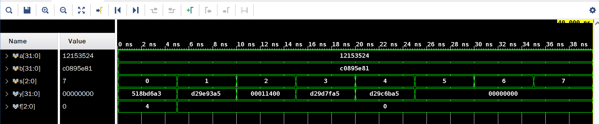

计算知波形正确.

### 6 位 ALU 模块下载测试

首先编写寄存器模块:

```verilog
module register #(parameter WIDTH = 6)
    (
        input [WIDTH-1:0] s,
        input en, rstn, clk,
        output reg [WIDTH-1:0] q);
    always@(posedge clk) begin
        if (~rstn)
            q <= 0;
        else
            if (en)
                q <= s;
            else
                q <= q;
    end

endmodule
```

之后在下载的 top 模块中引用:

```verilog
module alu_top(
        input [15:0] sw,
        input en, rstn, clk,
        output [15:13] ledf,
        output [5:0] ledy
    );

    wire [5:0] a, b, y;
    wire [2:0] s, f;

    register #(.WIDTH(3)) s1(sw[15:13], en, rstn, clk, s);
    register #(.WIDTH(3)) s2(f, 1'b1, rstn, clk, ledf);
    register s3(sw[11:6], en, rstn, clk, a);
    register s4(sw[5:0], en, rstn, clk, b);
    register s5(y, 1'b1, rstn, clk, ledy);

    alu #(.WIDTH(6)) alu_inst(a, b, s, y, f);

endmodule
```

之后按照实验讲义的要求编写 xdc 文件即可成功生成 .bit 文件并上板.

下面放两张测试截图:

|   减法 (6'b100111 - 6'b000011, 有符号小于)   |                算术右移 (6'b111111 >>> 1)                |
| :------------------------------------------: | :------------------------------------------------------: |
| 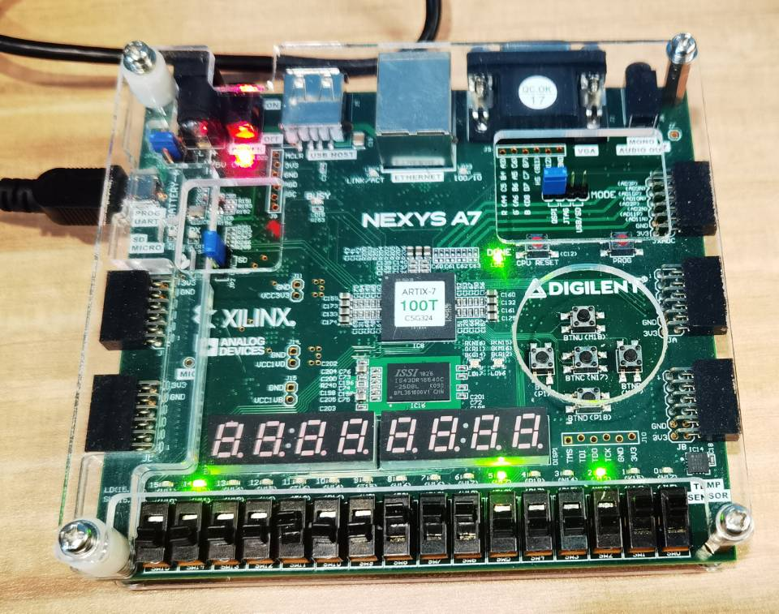 | 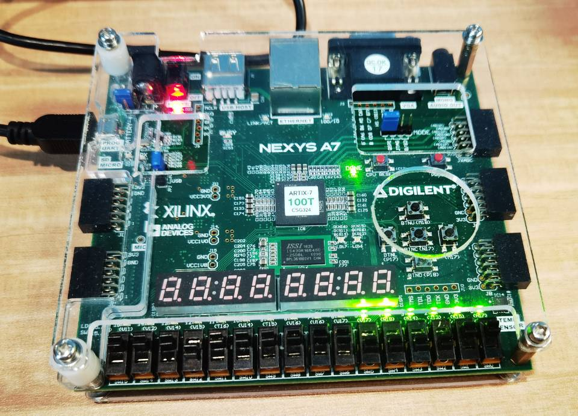 |

#### RTL 电路

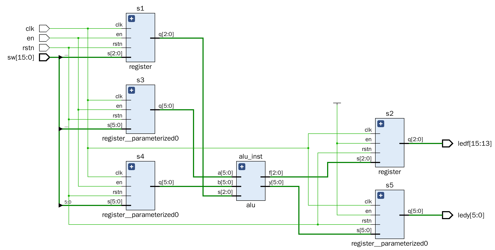

#### 电路资源使用情况

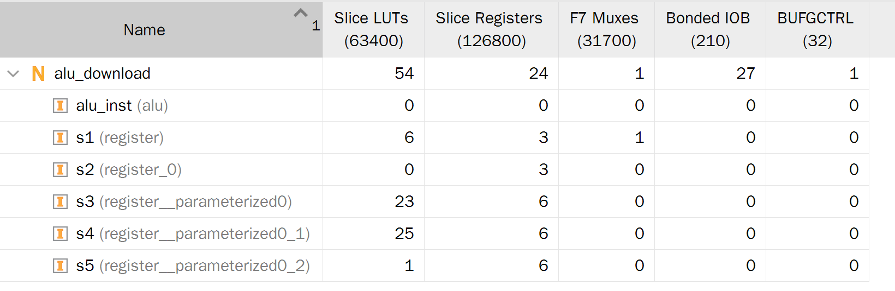

#### 时间性能报告

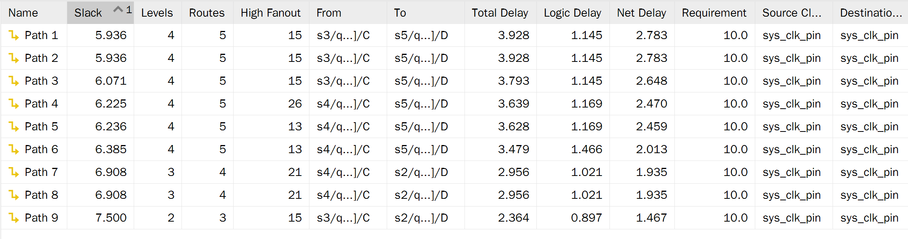

### FLS 模块设计

#### 状态机设计

要计算斐波那契数列, 需要两个寄存器 `a`, `b` 用于寄存 `f_n-2` 和 `f_n-1`, 为了设计二段式 Moore 型状态机, 思路是把要输出的数每次都放到 `a` 中输出, 最后只要让 `f = a` 即可.

初始状态记作 `S0`, 此时初始化 `a`, `b`, `f` 为 0, 其他状态复位时回到 `S0`, 当 `S0` 遇到有效 `en` 信号进入到 `S1`.

`S1` 在 `a` 未被初始化时读取 `d` 并寄存到 `a`, 遇到有效 `en` 信号进入状态 `S2`.

`S2` 状态会在 `b` 未被初始化时将 `a` 存到 `b` 读取 `d` 并寄存到 `a`, 遇到有效 `en` 信号进入状态 `S3`.

`S3` 状态执行加法, `a <= a + b`, `b <= a`, 遇到无效 `en` 信号回到 `S2`.

状态图:

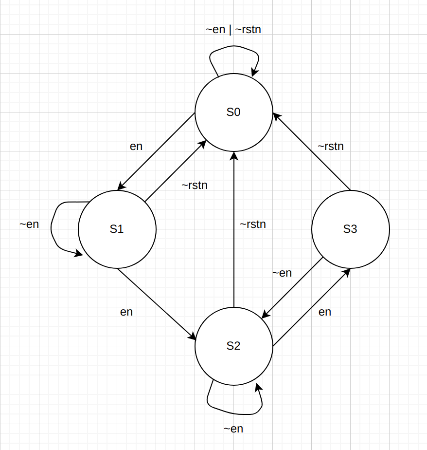

#### 核心代码

首先实例化一个 ALU, 在迭代计算数列下一项时用:

```verilog
alu #(.WIDTH(16)) alu_inst(a, b, 3'b001, sum);
```

组合逻辑描述下一个状态:

```verilog
always@(*) begin
    case(cur_state)
        S0:
            next_state = en ? S1 : S0;
        S1:
            next_state = en ? S2 : S1;
        S2:
            next_state = en ? S3 : S2;
        default:
            next_state = en ? S3 : S2;
    endcase
end
```

接下来用两个时序逻辑分别描述状态转移和每个状态的行为:

```verilog
always@(posedge clk)
    cur_state = (rstn) ? next_state : S0;

always@(posedge clk) begin
    case(cur_state)
        S0: begin
            a <= 0;
            b <= 0;
        end
        S1: begin
            a <= (a) ? a : d;
        end
        S2: begin
            b <= (b) ? b : a;
            a <= (b) ? a : d;
        end
        default: begin
            a <= sum;
            b <= a;
        end
    endcase
end
```

最后是简单的组合逻辑描述输出:

```verilog
always@(*)
    f = a;
```

#### FLS 模块仿真

编写 testbench 如下:

```verilog
module fls_tb();
    reg clk, rstn, en;
    reg [15:0] d;
    wire [15:0] f;

    initial begin
        clk = 0;
        forever
            #5 clk = clk + 1;
    end

    initial begin
        rstn = 0;
        #8 rstn = 1;
    end

    initial begin
        en = 0;
        #12 en = 1;
        #9 en = 0;
        #21 en = 1;
        #10 en = 0;
        #10 en = 1;
        #10 en = 0;
        #10 en = 1;
        #10 en = 0;
        #5 $finish;
    end

    initial begin
        d = 2;
        #32 d = 3;
        #20 d = 4;
    end

    fls fls_inst(clk, rstn, en, d, f);
endmodule
```

在 Vivado 进行仿真, 波形图如下:

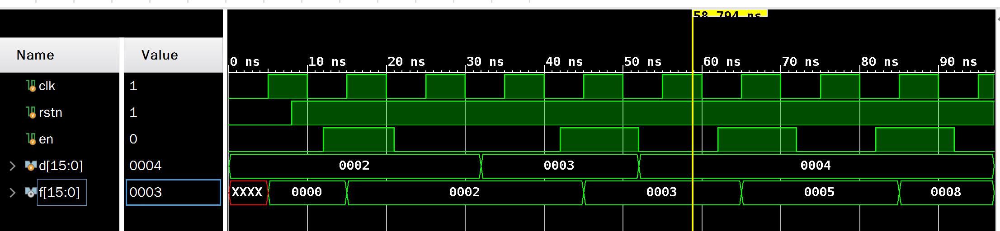

可以发现与讲义相符.

### FLS 模块下载测试

首先需要编写一个取边沿的模块 `en_edge`:

```verilog
module en_edge(
        input en, clk,
        output out
    );
    reg [15:0] cnt;

    always@(posedge clk) begin
        if (en == 0)
            cnt <= 0;
        else if (cnt < 16'h8000)
            cnt <= cnt + 1;
        else
            cnt <= cnt;
    end

    reg en1, en2;
    always@(posedge clk) begin
        en1 <= cnt[15];
        en2 <= en1;
    end

    assign out = en1 & ~en2;

endmodule
```

然后编写 xdc 和 top 模块:

```verilog
module fls_top (
        input clk,
        input rstn,
        input en,
        input [15:0] sw,
        output [15:0] led
    );

    wire out;
    en_edge inst(en, clk, out);
    fls fls_inst(clk, rstn, out, sw, led);
endmodule
```

烧写到开发板上进行测试, 与预期相符.

#### RTL 电路

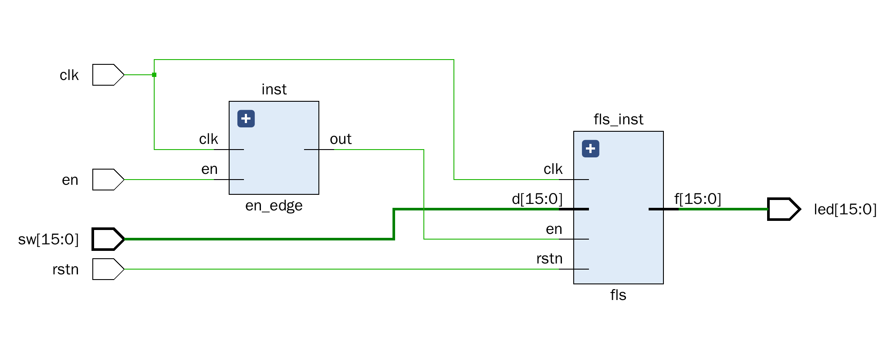

#### 电路资源使用情况

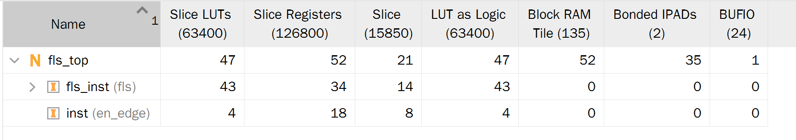

#### 时间性能报告

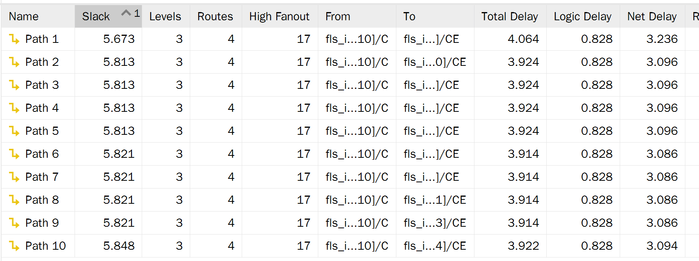

## 总结与建议

本次实验我收获颇丰, 主要包括以下几个方面:

1. 体验了将生成的 bit 文件到烧写到开发板上. 上学期的数电实验使用 FPGA 在线平台, 没能摸到板子, 这学期在真正的板子上进行烧写, 体验明显是更好的.
2. 加强了仿真的练习. 之前数电实验里的实验大多比较简单, 不需要太多的 debug, 本实验难度则明显较大, 使用仿真进行 debug 显然比每次改完都尝试生成 bit 文件并烧写的效率来得高多了.
3. 学会更好地设计状态机. 一开始我设计出的是三段式 Mealy 型状态机, 并且有五个状态 (如下图). 一开始设计状态机时的逻辑是比较混乱的, 并没有刻意追求输出是在组合逻辑还是时序逻辑, 最后经过思考才改成了四个状态的两段式 Moore 型状态机.

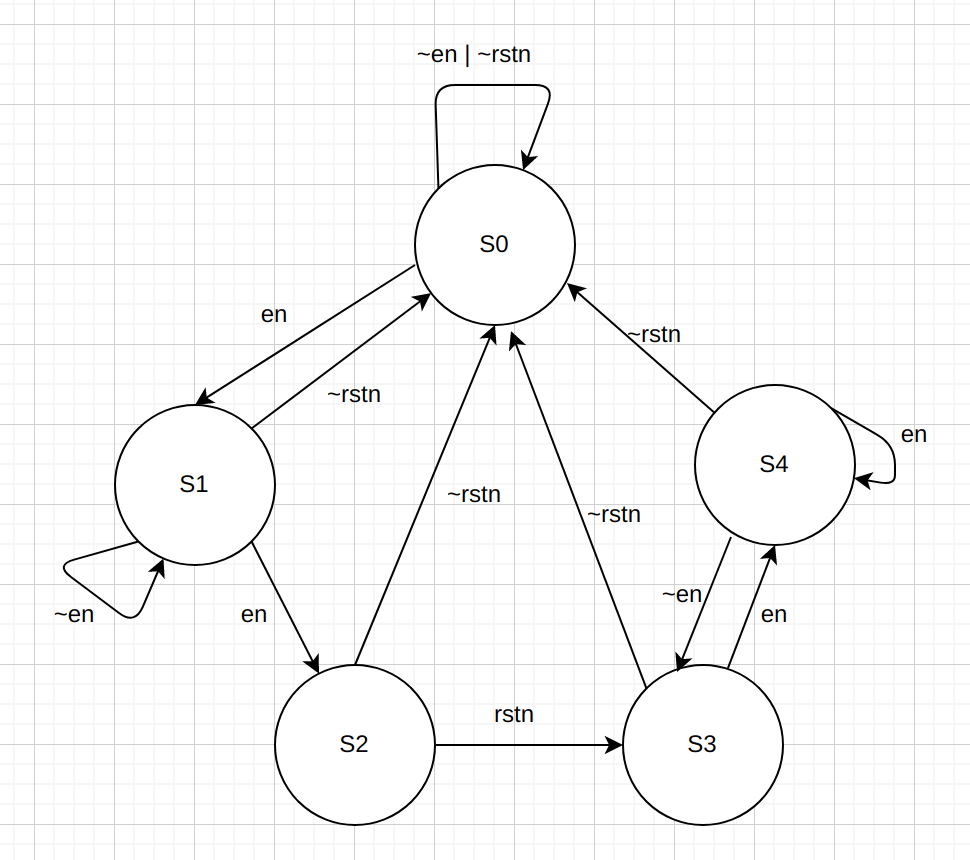

4. 学会了查看 RTL 电路, 电路资源使用情况以及时间性能报告.

对实验的建议是可以先进行预备实验, 教会同学们如何使用开发板, 我一开始使用 Vlab 来写 Verilog, 生成的 bit 文件不知道如何烧写到板子上, 花去了较多时间搜索开发板的使用.