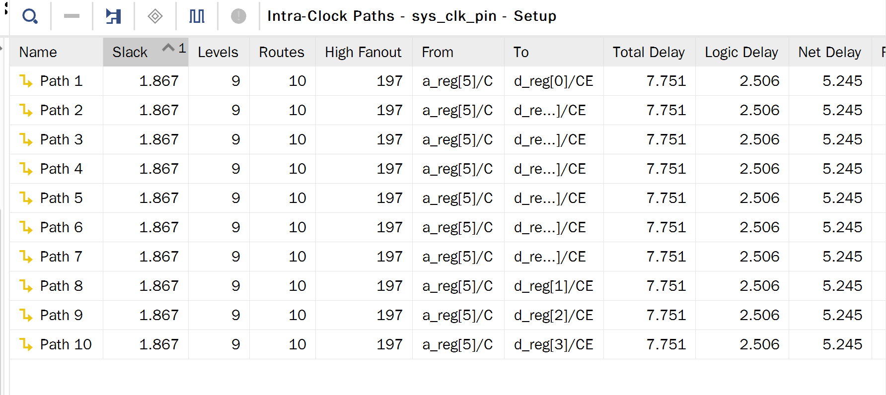

<div style="text-align:center;font-size:2em;font-weight:bold;margin-top:20%">中国科学技术大学计算机学院</div>

<div style="text-align:center;font-size:2em;font-weight:bold">《数字电路实验报告》</div>


<div style="display: flex;flex-direction: column;align-items: center;font-size:1.5em">
<div>
<p>实验题目：寄存器堆与存储器及其应用</p>
<p>学生姓名：许坤钊</p>
<p>学生学号：PB20111714</p>
<p>完成时间：2022.3.31</p>
</div>
</div>

<div style="page-break-after:always"></div>

## 实验题目

寄存器堆与存储器及其应用

## 实验目的

+ 掌握寄存器堆（Register File）和存储器的功能、时序及其应用
+ 熟练掌握数据通路和控制器的设计和描述方法

## 实验环境

+ Ubuntu 20.04 LTS
+ Vivado 2019.1
+ Nexys4 xc7a100tcsg324-1 开发板

## 实验过程

### 32x32 位的寄存器堆的功能仿真

要求的端口示意如下：


讲义给出的寄存器堆模块已经大致可以满足要求，我们只要稍作修改，保证 0 号寄存器内容恒定为 0，同时，为了保证写优先，还需要修改一下读的组合逻辑：

```verilog
module register_file#(
        parameter AW = 5, // 地址宽度
        parameter DW = 32) // 数据宽度
    (input clk, // 时钟
     input [AW-1:0] ra0, ra1, // 读地址
     output [DW-1:0] rd0, rd1, // 读数据
     input [AW-1:0] wa, // 写地址
     input [DW-1:0] wd,	// 写数据
     input we			// 写使能
    );
    reg [DW-1:0] rf [0:(1<<AW)-1]; // 寄存器堆

    always@(ra0, ra1)
        rf[0] = 0;

    always@(posedge clk)
        if (we && wa)
            rf[wa] <= wd; // 写操作

    assign rd0 = (ra0 == wa && we && wa != 0) ? wd : rf[ra0];
    assign rd1 = (ra1 == wa && we && wa != 0) ? wd : rf[ra1];
endmodule
```

之后对其进行仿真，编写 tb 如下：得到波形图如下：


符合题目要求。

### 分布式和块式单端口 RAM IP 核的功能仿真和对比

编写 tb 如下：

```verilog
module mem_tb();
    reg clk, we;
    reg [7:0] a;
    reg [15:0] dina;
    wire [15:0] spo, rf_douta, wf_douta;

    dist_mem_gen_0 dm_inst(.a(a), .d(dina), .clk(clk), .we(we), .spo(spo));
    blk_mem_gen_0 rfbm_inst(.addra(a), .dina(dina), .clka(clk), .wea(we), .douta(rf_douta), .ena(1));
    blk_mem_gen_1 wfbm_inst(.addra(a), .dina(dina), .clka(clk), .wea(we), .douta(wf_douta), .ena(1));

    initial begin
        clk = 1;
        forever
            #10 clk = ~clk;
    end

    initial begin
        we = 0;
        #32 we = 1;
        #40 we = 0;
    end

    initial begin
        #32 dina = 16'h1111;
        #20 dina = 16'h2222;
        #20 dina = 16'h3333;
    end

    initial begin
        #15 a = 8'haa;
        #20 a = 8'hbb;
        #20 a = 8'hcc;
        #20 a = 8'hdd;
    end

    initial begin
        #100 $finish;
    end

endmodule
```

仿真波形：


对该波形稍作解释：

用 coe 文件对两个块式存储器都做了初始化，其初始值对应如下：

```python
mp = {0xaa: "7ab1", 0xbb: "281b", 0xcc: "13c0", 0xdd: "427d"}
```

`spo` 是分布式存储器的输出，由于其读是异步的，因此 spo 的值一定是 a 端口指示的值，在 40ns 时 0x1111 被写入 0xbb 地址，spo 立刻就将之读出，之后叶也是类似的。

`rf_douta` 是读优先（read first）块式存储器的输出，因为读优先的性质，在 40ns 时虽然 0x1111 被写进 9xbb 地址，但读出来的依然是上个周期的值 0x281b，60ns 时也是类似的。

`wf_douta` 是写优先（write first）块式存储器的输出，因为写优先的性质，在 40ns 时 0x1111 被写进 9xbb 地址，同时就被 `wf_douta` 读出，60ns 时也是类似的。

### 排序电路设计和下载

排序模块端口示意图：


#### 设计思路

这里的模块只贴出核心代码，完整的代码可以在附件的 `src` 文件夹中查看。

+ 输入：输入模仿讲义，首先编写 `dp` 和 `dpe` 模块，用于对按钮去抖动，并取单/双边沿，其中需要用到去抖动模块 `db`、取单边沿模块 `btn_edge` 和取双边沿模块 `double_edge`（采用两个单边沿模块取或得到）

  ```verilog
  module dpe #(parameter CYCLE=25) ( // 去抖动、取双边沿、编码
          input clk, rstn,
          input [15:0] x,
          output reg p,
          output reg [3:0] h
      );
  
      wire [15:0] db_x, edge_x;
      generate
          genvar i;
          for (i = 0; i < 16; i = i + 1) begin: DPE_BLOCK
              db #(.CYCLE(CYCLE)) db_inst(clk, x[i], rstn, db_x[i]);
              double_edge edge_inst(clk, db_x[i], edge_x[i]);
          end
      endgenerate
  
      wire tmp_p;
      reg [15:0] tmp_h; // 寄存，使得 h 脉冲能持续多周期
  
      assign tmp_p = |edge_x;
      always@(posedge clk) begin
          p <= tmp_p;
      end
  
      always@(posedge clk)
          if (~rstn)
              tmp_h <= 0;
          else if (tmp_p)
              tmp_h <= edge_x;
  
      always@(*) begin
          case (tmp_h)
              16'h0001:
                  h = 0;
              16'h0002:
                  h = 1;
              16'h0004:
                  h = 2;
              16'h0008:
                  h = 3;
              16'h0010:
                  h = 4;
              16'h0020:
                  h = 5;
              16'h0040:
                  h = 6;
              16'h0080:
                  h = 7;
              16'h0100:
                  h = 8;
              16'h0200:
                  h = 9;
              16'h0400:
                  h = 10;
              16'h0800:
                  h = 11;
              16'h1000:
                  h = 12;
              16'h2000:
                  h = 13;
              16'h4000:
                  h = 14;
              16'h8000:
                  h = 15;
              default:
                  h = 0;
          endcase
      end
  endmodule
  
  module dp #(parameter CYCLE=16) (
          input clk, rstn, chk, del, data, addr,
          output chk_p, del_p, data_p, addr_p
      );
  
      wire r1, r2, r3, r4;
      db #(.CYCLE(16)) db_inst1(clk, chk, rstn, r1);
      btn_edge edge_inst1(clk, r1, chk_p);
  
      db #(.CYCLE(16)) db_inst2(clk, del, rstn, r2);
      btn_edge edge_inst2(clk, r2, del_p);
  
      db #(.CYCLE(16)) db_inst3(clk, data, rstn, r3);
      btn_edge edge_inst3(clk, r3, data_p);
  
      db #(.CYCLE(16)) db_inst4(clk, addr, rstn, r4);
      btn_edge edge_inst4(clk, r4, addr_p);
  
  endmodule
  ```

  之后我们到顶层模块中对其例化，由于排序时不允许输入，还需要一个输入使能信号 `input_en`，输入部分：

  ```verilog
  always@(posedge clk) begin
      if (input_en) begin // 输入
          if (~rstn) begin
              a <= 0;
              d <= 0;
              s <= 0;
          end
  
          else if (chk_p) begin
              a <= a + 1;
              s <= 0;
          end
  
          else if (p) begin
              d <= {d[11:0], h};
              s <= 1;
          end
  
          else if (del_p) begin
              d = d[15:4];
              s <= 1;
          end
  
          else if (data_p) begin
              d <= 0;
              a <= a + 1;
              s <= 0;
          end
  
          else if (addr_p) begin
              a <= d[7:0];
              d <= 0;
              s <= 0;
          end
      end
  end
  ```
+ 输出：分时复用即可。
+ 排序：采取冒泡排序，可以实现原地的排序，其高级语言代码如下:

  ```python
  for i in range(1, 256):
      for j in range(0, 256 - i):
          if arr[j] > arr[j + 1]:
              arr[j], arr[j + 1] = arr[j + 1], arr[j]
  ```

  需要比较相邻两个数的大小，因此让 `dpra` 始终为 `a + 1`，状态机的设计涉及的寄存器和信号：

  `a`：类似高级语言中的 `j`

  `i`：指示 `a` 一轮增加的终点

  `larger`：`spo` 是否比 `dpo` 大的信号

  `sorted`：排序完毕

  `swaped`：一轮扫描过程中经历了交换（如果没有也说明排序完毕）

  状态图如下：

  ```mermaid
  graph LR
  
  0((S0, io))--run-->1((S1, init))
  1-->2((S2, judge))
  2--sorted or swaped-->3((S3, finish))
  3-->0
  2-->4((S4, cmp and swap1))
  4--a==i+1-->2
  4-->4
  4--larger-->5((S5, swap2))
  5-->4
  ```

  S0 为默认状态，此时在进行 io，当接收到 `run` 信号后转到状态 S1，对信号进行初始化（例如 `busy`，全局计数器 `i` 等），之后来到状态 S2。

  S2 判断排序是否应该结束，如果结束就来到状态 S3，进行排序结束后一些信号的设置。否则把 `a` 置 0，到 `S4` 进行比较，如果 `larger` 信号为 1，需要进行交换，由于存储器一个周期只能写入一个值，交换需要额外一个 S5 状态方可完成。

  在编写 Verilog 代码时，时序问题非常关键，在 S4 设置好了写使能和写数据后，在 S5 才能写入，S5 修改的数据也需要回到 S4 后才能写入。此外，由于硬件电路的延迟，spo 的值可能会延迟一个周期，因此我们用 `true_spo` 信号来确定 `spo` 的真实值：

  ```verilog
  reg sel;
  wire [15:0] true_spo;
  assign true_spo = sel ? d : spo;
  assign larger = (true_spo > dpo) ? 1 : 0;
  ```

  `sel` 在 S4 状态需要交换时被设置为 1.

  此外，边界问题同样重要。状态转换代码如下：

  ```verilog
  // 状态机
  always@(*) begin
      case (state)
          S0: begin
              if (run) begin
                  next_state = S1;
                  input_en = 0;
              end
              else begin
                  next_state = S0;
                  input_en = 1;
              end
          end
          S1:
              next_state = S2;
          S2: begin
              if (sorted | ~swaped)
                  next_state = S3;
              else
                  next_state = S4;
          end
          S3: begin
              next_state = S0;
          end
          S4: begin
              if (a == i + 1)
                  next_state = S2;
              else if (larger)
                  next_state = S5;
              else
                  next_state = S4;
          end
          S5: begin
              next_state = S4;
          end
      endcase
  end
  
  // 状态转移
  always@(posedge clk) begin
      if (rstn)
          state <= next_state;
      else
          state <= S0;
  end
  ```

  排序代码：

  ```verilog
  case (state)
      S0: begin // default state
          busy <= 0;
      end
  
      S1: begin // init
          busy <= 1;
          cnt <= 0;
          i <= 255;
          we_sort_en <= 0;
          sel = 0;
      end
  
      S2: begin // judge
          i <= i - 1;
          a <= 0;
          swaped <= 1;
          cnt <= cnt + 1;
      end
  
      S3: begin // finish
          busy <= 0;
          a <= 0;
      end
  
      S4: begin // cmp and swap1
          we_sort_en <= 0;
          sel <= 0;
          if (larger && a != (i + 1)) begin
              swaped <= 1;
              we_sort_en <= 1;
              d <= dpo;
              tmp <= true_spo;
          end
          else begin
              a <= a + 1;
          end
          cnt <= cnt + 1;
      end
  
      S5: begin // swap2
          d <= tmp;
          a <= a + 1;
          cnt <= cnt + 1;
          sel <= 1;
      end
  endcase
  ```

#### 排序功能仿真

仿真波形图如下（初始值为 256 个随机的整数，这里无法展示排序的过程，只截取存储器最大的 11 个值的初态和末态）：

初态：


末态：


#### RTL 电路


#### 电路资源使用情况


#### 综合电路性能



#### 下载图片

下载结果已经经过线下检查，下面放几张图片作为示意：

|                 下载示意图                 |                 下载示意图                 |                   下载示意图                   |
| :----------------------------------------: | :-----------------------------------------: | :---------------------------------------------: |
|     烧写后初始状态     | 按下 chk 查看下一处地址 | 查看一开始地址 0x00 处的值 |
| 按下排序后查看第一个值 |   排序后查看第二个值   | 排序后查看地址 0xff 处的值 |

## 总结与建议

### 实验总结

+ 通过本次实验，我重温了如何用数码管展示数据的知识，同时巩固了对取边沿、去抖动模块的使用。
+ 我对存储器的时序有了更深刻的认识，能够更好的写出有合理时序的 Verilog 代码。

### 建议

+ 本次实验与实验一难度跨度过大，主要体现在排序模块的输入比实验一复杂很多，同时 Debug 难度很大，经常会出现时序的错误，建议减小实验难度，否则会花去大量时间。
+ 可以考虑通过 Git 分发实验，包含一些已经写好的模块，例如取边沿，分时复用输出以及其他模块的端口等。这样可以减轻实验的负担。
