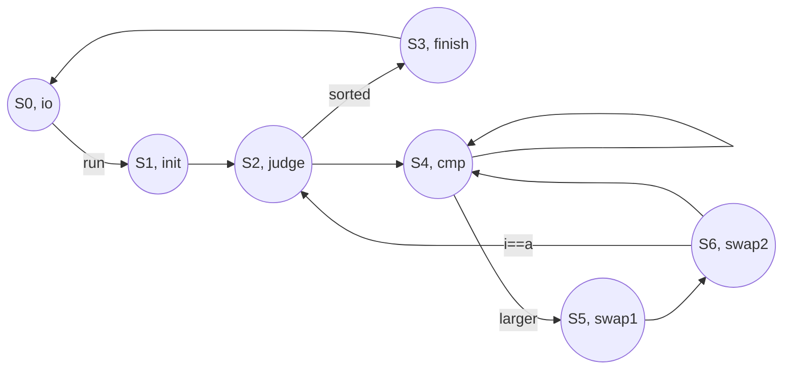

```mermaid
graph LR

0((S0, io))--run-->1((S1, init))
1-->2((S2, judge))
2--sorted-->3((S3, finish))
3-->0
2-->4((S4, cmp))
4-->4
4--larger-->5((S5, swap1))
5-->6((S6, swap2))
6--i==a-->2
6-->4

```

