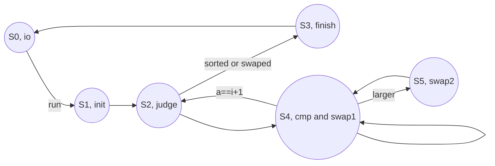

```mermaid
graph LR

0((S0, io))--run-->1((S1, init))
1-->2((S2, judge))
2--sorted or swaped-->3((S3, finish))
3-->0
2-->4((S4, cmp and swap1))
4--a==i+1-->2
4-->4
4--larger-->5((S5, swap2))
5-->4

```

