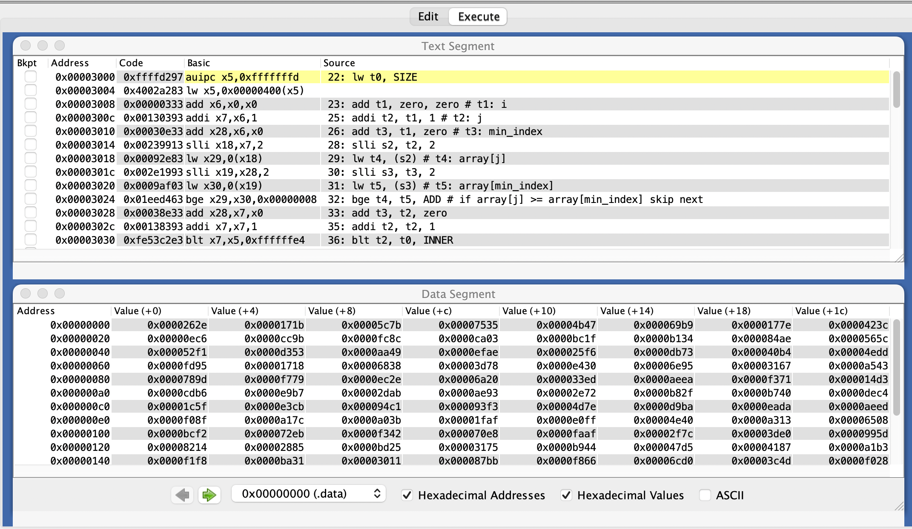
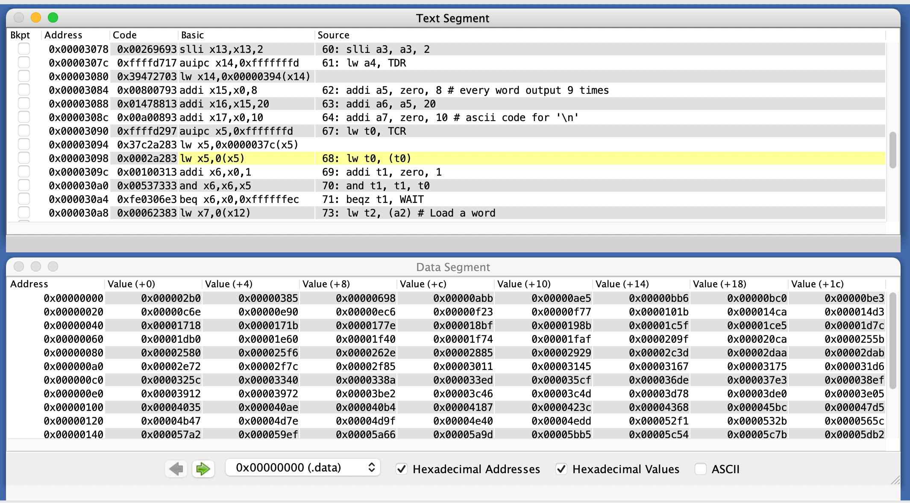
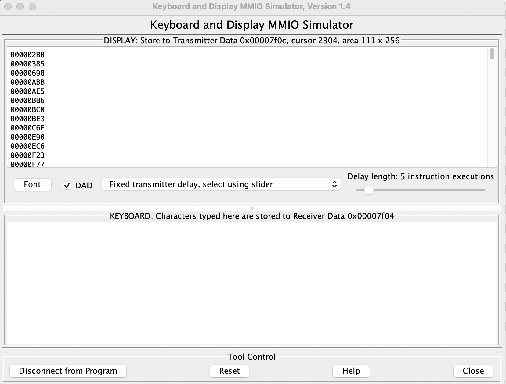

<div style="text-align:center;font-size:2em;font-weight:bold;margin-top:20%">中国科学技术大学计算机学院</div>

<div style="text-align:center;font-size:2em;font-weight:bold;">《计算机组成原理实验报告》</div>


<div style="display: flex;flex-direction: column;align-items: center;font-size:1.5em">
<div>
<p>实验题目：汇编程序设计</p>
<p>学生姓名：许坤钊</p>
<p>学生学号：PB20111714</p>
<p>完成时间：2022.04.06
</div>
</div>


<div style="page-break-after:always"></div>

## 实验题目

汇编程序设计

## 实验目的

+ 了解汇编程序的基本结构, 以及汇编程序仿真和调试的基本方法
+ 熟悉 RISC-V 常用 32 位整数指令的功能, 掌握简单汇编程序的设计, 以及 CPU 下载测试方法和测试数据 (COE 文件) 的生成方法

## 实验环境

+ MacOS Monterey 12.3
+ RARS v1.5

## 实验过程

### 设计汇编程序, 实现对 10 条指令功能的逐条简单测试和人工检查, 并生成 COE 文件

编写的汇编程序如下:

```assembly
.data # assume start address 0

led_data: .word 0xffff # led status, all on at the beginning
swt_data: .word 0xa7b5 # switch status

.text
sw zero, (zero) # test1 sw: led all of

addi t0, zero, 0xff # test2 addi: led[7:0] still on
sw t0, (zero) 

lw t0, 4(zero) # test3 lw: led = switch
sw t0, (zero)

addi t2, zero, 0x7 # test4 add: led = switch + 7
add t1, t0, t2  
sw t1, (zero)

sub t1, t1, t2 # test5 sub: led = switch
sw t1, (zero)

auipc t1, 0xfffff # test6 auipc: led = 0x2028
sw t1, (zero)

addi t2, zero, 0x7 # test7, 8 beq, jal: led = loop ? i : addr(jal + 4)
add t1, zero, zero
LOOP1:
beq t1, t2, END
addi t1, t1, 1
sw t1, (zero)
jal LOOP1
END:
sw ra, (zero)

addi t2, zero, 0x7 # test9 blt: led = i, for i in range(1, 7)
add t1, zero, zero
LOOP2:
addi t1, t1, 0x1
sw, t1, (zero)
blt t1, t2, LOOP2

jalr ra, ra, 0 # test10 jalr
```

注意到我们首先测试了 `sw, addi, lw` 等指令, 前面测过的指令经验证正确后就可以用于后面的测试. 此外, 测试时由于模拟下载, 因此所有观测结果都通过地址 0 处的 `led` 的数值来判断.

下面逐一说明测试的正确性.

一开始的状态:


1. `sw` 指令, 运行后 led 全灭, 说明结果正确:

    

2. `addi` 指令, 运行后 led 的低 8 位变亮, 说明结果正确:

    

3. `lw` 指令, 运行后 `led` 的值与开关状态相同, 说明结果正确:

    

4. `add` 指令, 运行后 `led` 的值变为 `switch + 7`, 说明结果正确:

    

5. `sub` 指令, 运行后 `led` 变回与开关相同, 说明结果正确:

    

6. `aupic` 指令, 运行后 led 将变为当前 `pc + 0xfffff000`, 注意到 `.text` 段的起始地址是 `0x3000`, 因此 PC 此时的值是 `0x3028`, `0x3028 + 0xfffff000 = 0x2028`, `led` 变为 `0x2028` 说明结果正确:

    

7. 这里同时测试了 `beq` 和 `jal` 指令, 一开始把 `t1` 置 0, `t2` 置 7, 如果 `t1 != t2` 用 jal 进行循环, 每次循环 `t1` 自增, 相等时跳出, 为了确认正在进行循环, 循环时 `led` 的值设为与 `t1` 相同, 退出时设为 `ra` 以测试 `jal` 是否把返回地址写入 `ra`.

    循环时截图:

    

    循环结束后截图:

    

    说明结果正确.

8. `blt` 指令, 逻辑与之前的 `beq` 类似,

    循环时:

    

    循环结束:

    

9. `jalr` 指令, 把下一条指令地址存到 `ra`, `ra` 将变为`0x3060`, 同时会跳到之前 `ra` 指向的位置, 也就是 `0x304c` 执行指令, 之后再次来到 `jalr` 时, 由于 `ra` 已经变化, 不会死循环.

    刚跳转时:

    指令执行完毕:

    

### 设计汇编程序, 实现数组排序, 并生成 COE 文件

#### 排序

使用选择排序, 其高级语言实现如下:

```cpp
void selection_sort(size_t array[], size_t size) {
    for (int i = 0; i < size - 1; ++i) {
        int min_index = i;
        for (int j = i + 1; j < size; ++j) {
            if (array[j] < array[min_index]) {
                min_index = j;
            }
        }
        std::swap(array[i], array[min_index]);
    }
}
```

注意到 `i` 循环上限可以增加到 `size-1`, 这也便于写汇编代码. 将 `i` 上限修改为 `size-1` 后翻译为汇编代码, 需要两层循环以及一个 `swap` 函数, 具体代码见附件.

#### MMIO

根据 RARS 中 *MMIO Simulator* 的介绍, 可以知道输出需要两个寄存器, 位于 0x7f08 的 *Transmitter Control register*(下称 TCR) 和位于 0x7f0c 的 *Transmitter Data register*(下称 TDR), 我们轮询 TCR, 直到其最低位为 1, 把需要输出的数据写入 TDR 中, 由于输出数据需要是数字对应的 ASCII 码, 每个数 (32bit) 我们输出 8 次, 同时输出一个换行符, 这通过一个循环进行, 伪码描述如下:

```c
int a = load_word();
int i = 8;
while (i >= 0) {
    if (i == 0) {
        store_word(0xa);
    } else {
        a >>= (4 * i - 4);
        if (a < 10) {
            store_word(a + 0x30);
        } else {
            store_word(a + 0x37);
        }
    }
}
```

这里 `store_word(x)` 意为把 `x` 存到 TDR 寄存器中.

下面展示测试结果, 一开始的数组 (256 个数) 为

```text
0x262e, 0x171b, 0x5c7b, 0x7535, 0x4b47, 0x69b9, 0x177e, 0x423c, 0xec6, 0xcc9b, 0xfc8c, 0xca03, 0xbc1f, 0xb134, 0x84ae, 0x565c, 0x52f1, 0xd353, 0xaa49, 0xefae, 0x25f6, 0xdb73, 0x40b4, 0x4edd, 0xfd95, 0x1718, 0x6838, 0x3d78, 0xe430, 0x6e95, 0x3167, 0xa543, 0x789d, 0xf779, 0xec2e, 0x6a20, 0x33ed, 0xaeea, 0xf371, 0x14d3, 0xcdb6, 0xe9b7, 0x2dab, 0xae93, 0x2e72, 0xb82f, 0xb740, 0xdec4, 0x1c5f, 0xe3cb, 0x94c1, 0x93f3, 0x4d7e, 0xd9ba, 0xeada, 0xaeed, 0xf08f, 0xa17c, 0xa03b, 0x1faf, 0xe0ff, 0x4e40, 0xa313, 0x6508, 0xbcf2, 0x72eb, 0xf342, 0x70e8, 0xfaaf, 0x2f7c, 0x3de0, 0x995d, 0x8214, 0x2885, 0xbd25, 0x3175, 0xb944, 0x47d5, 0x4187, 0xa1b3, 0xf1f8, 0xba31, 0x3011, 0x87bb, 0xf866, 0x6cd0, 0x3c4d, 0xf028, 0xa7e4, 0xbe3d, 0x1ce5, 0x7f07, 0x99a8, 0x2b0, 0xaf0f, 0x532b, 0x5a66, 0x1d7c, 0x8c5d, 0x20ca, 0x36de, 0x6154, 0x9ccf, 0x385, 0x38ef, 0x9e70, 0x2f85, 0x6584, 0x8c28, 0xc0fc, 0x6c88, 0x5bb5, 0x3972, 0xd029, 0x8715, 0x99cc, 0x61e0, 0x6b53, 0xd032, 0x6f0b, 0x9cd6, 0xa3d0, 0x1f74, 0xfaff, 0xd512, 0x7617, 0x5fba, 0x63d2, 0x65c6, 0x9d18, 0x31d6, 0x8ddf, 0xed04, 0xff1b, 0xbc0, 0x3e05, 0xb8a1, 0xfff9, 0x3912, 0x8bd6, 0xabb, 0xd9be, 0x45bc, 0xbb6, 0x4368, 0xe2a1, 0x18bf, 0xe405, 0x944a, 0xc639, 0x5fab, 0x2c3d, 0xd51d, 0x639d, 0x14ca, 0xa990, 0xa175, 0x6368, 0x7e88, 0xb1b3, 0x198b, 0x7044, 0x59ef, 0xf23, 0x5c54, 0x1db0, 0x698, 0x79cc, 0x1f40, 0xc6e, 0x752b, 0x8b58, 0x40ae, 0xa526, 0xa7d7, 0x837c, 0x9512, 0x691a, 0x68de, 0x338a, 0xbcbf, 0xda32, 0xfcc0, 0x9842, 0x6017, 0xe90, 0x3c46, 0x9ab5, 0x57a2, 0xc157, 0x5db2, 0xf77, 0x718a, 0x9140, 0xb686, 0xbe3, 0xf156, 0x8807, 0x7f75, 0xaa39, 0x9e00, 0xcb95, 0x63fd, 0xe2ae, 0x4d9f, 0x99d3, 0xe34a, 0x255b, 0x8735, 0xd1bb, 0x1e60, 0xeb79, 0x983e, 0xa118, 0xa008, 0x5a9d, 0xa610, 0x101b, 0xc979, 0x325c, 0x7406, 0x74e6, 0x682f, 0x8d29, 0xf8c7, 0x2daa, 0x9b29, 0xce23, 0x6a96, 0x9a18, 0xae5, 0xf7dc, 0x3340, 0xe7f6, 0xf479, 0xc0b6, 0xc15f, 0x7dab, 0x37e3, 0xbf29, 0xf1ab, 0xc2cb, 0xbbc0, 0x4035, 0xf99a, 0xf16c, 0x3be2, 0xdb4d, 0x35cf, 0xf3c1, 0x70e5, 0x766e, 0x3145, 0x2580, 0x209f, 0x2929
```

高级语言代码排序后得到:

```
0x2b0, 0x385, 0x698, 0xabb, 0xae5, 0xbb6, 0xbc0, 0xbe3, 0xc6e, 0xe90, 0xec6, 0xf23, 0xf77, 0x101b, 0x14ca, 0x14d3, 0x1718, 0x171b, 0x177e, 0x18bf, 0x198b, 0x1c5f, 0x1ce5, 0x1d7c, 0x1db0, 0x1e60, 0x1f40, 0x1f74, 0x1faf, 0x209f, 0x20ca, 0x255b, 0x2580, 0x25f6, 0x262e, 0x2885, 0x2929, 0x2c3d, 0x2daa, 0x2dab, 0x2e72, 0x2f7c, 0x2f85, 0x3011, 0x3145, 0x3167, 0x3175, 0x31d6, 0x325c, 0x3340, 0x338a, 0x33ed, 0x35cf, 0x36de, 0x37e3, 0x38ef, 0x3912, 0x3972, 0x3be2, 0x3c46, 0x3c4d, 0x3d78, 0x3de0, 0x3e05, 0x4035, 0x40ae, 0x40b4, 0x4187, 0x423c, 0x4368, 0x45bc, 0x47d5, 0x4b47, 0x4d7e, 0x4d9f, 0x4e40, 0x4edd, 0x52f1, 0x532b, 0x565c, 0x57a2, 0x59ef, 0x5a66, 0x5a9d, 0x5bb5, 0x5c54, 0x5c7b, 0x5db2, 0x5fab, 0x5fba, 0x6017, 0x6154, 0x61e0, 0x6368, 0x639d, 0x63d2, 0x63fd, 0x6508, 0x6584, 0x65c6, 0x682f, 0x6838, 0x68de, 0x691a, 0x69b9, 0x6a20, 0x6a96, 0x6b53, 0x6c88, 0x6cd0, 0x6e95, 0x6f0b, 0x7044, 0x70e5, 0x70e8, 0x718a, 0x72eb, 0x7406, 0x74e6, 0x752b, 0x7535, 0x7617, 0x766e, 0x789d, 0x79cc, 0x7dab, 0x7e88, 0x7f07, 0x7f75, 0x8214, 0x837c, 0x84ae, 0x8715, 0x8735, 0x87bb, 0x8807, 0x8b58, 0x8bd6, 0x8c28, 0x8c5d, 0x8d29, 0x8ddf, 0x9140, 0x93f3, 0x944a, 0x94c1, 0x9512, 0x983e, 0x9842, 0x995d, 0x99a8, 0x99cc, 0x99d3, 0x9a18, 0x9ab5, 0x9b29, 0x9ccf, 0x9cd6, 0x9d18, 0x9e00, 0x9e70, 0xa008, 0xa03b, 0xa118, 0xa175, 0xa17c, 0xa1b3, 0xa313, 0xa3d0, 0xa526, 0xa543, 0xa610, 0xa7d7, 0xa7e4, 0xa990, 0xaa39, 0xaa49, 0xae93, 0xaeea, 0xaeed, 0xaf0f, 0xb134, 0xb1b3, 0xb686, 0xb740, 0xb82f, 0xb8a1, 0xb944, 0xba31, 0xbbc0, 0xbc1f, 0xbcbf, 0xbcf2, 0xbd25, 0xbe3d, 0xbf29, 0xc0b6, 0xc0fc, 0xc157, 0xc15f, 0xc2cb, 0xc639, 0xc979, 0xca03, 0xcb95, 0xcc9b, 0xcdb6, 0xce23, 0xd029, 0xd032, 0xd1bb, 0xd353, 0xd512, 0xd51d, 0xd9ba, 0xd9be, 0xda32, 0xdb4d, 0xdb73, 0xdec4, 0xe0ff, 0xe2a1, 0xe2ae, 0xe34a, 0xe3cb, 0xe405, 0xe430, 0xe7f6, 0xe9b7, 0xeada, 0xeb79, 0xec2e, 0xed04, 0xefae, 0xf028, 0xf08f, 0xf156, 0xf16c, 0xf1ab, 0xf1f8, 0xf342, 0xf371, 0xf3c1, 0xf479, 0xf779, 0xf7dc, 0xf866, 0xf8c7, 0xf99a, 0xfaaf, 0xfaff, 0xfc8c, 0xfcc0, 0xfd95, 0xff1b, 0xfff9
```

测试如下:

初始状态:



排序后 Data 段:



MMIO 输出:



## 附录文件结构

汇编文件在 `src/asm` 下, COE 文件在 `src/coe` 下.

## 总结与建议

+ 通过本次实验, 我学会了编写简单的汇编程序, 还学会了 RARS 软件的使用, 以及使用 MMIO.
+ 本次实验任务量合适, 建议其他实验任务量向本次实验看齐.