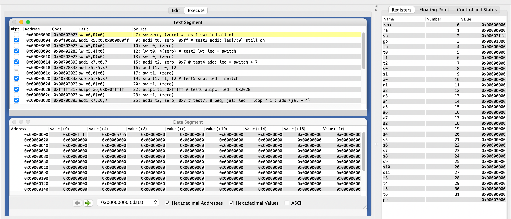

<div style="text-align:center;font-size:2em;font-weight:bold;margin-top:20%">中国科学技术大学计算机学院</div>

<div style="text-align:center;font-size:2em;font-weight:bold;">《计算机组成原理实验报告》</div>


<div style="display: flex;flex-direction: column;align-items: center;font-size:1.5em">
<div>
<p>实验题目：汇编程序设计</p>
<p>学生姓名：许坤钊</p>
<p>学生学号：PB20111714</p>
<p>完成时间：2022.04.06
</div>
</div>


<div style="page-break-after:always"></div>

## 实验题目

汇编程序设计

## 实验目的

+ 了解汇编程序的基本结构, 以及汇编程序仿真和调试的基本方法
+ 熟悉 RISC-V 常用 32 位整数指令的功能, 掌握简单汇编程序的设计, 以及 CPU 下载测试方法和测试数据 (COE 文件) 的生成方法

## 实验环境

+ MacOS Monterey 12.3
+ RARS v1.5

## 实验过程

### 设计汇编程序, 实现对 10 条指令功能的逐条简单测试和人工检查, 并生成 COE 文件

编写的汇编程序如下:

```assembly
.data # assume start address 0

led_data: .word 0xffff # led status, all on at the beginning
swt_data: .word 0xa7b5 # switch status

.text
sw zero, (zero) # test1 sw: led all of

addi t0, zero, 0xff # test2 addi: led[7:0] still on
sw t0, (zero) 

lw t0, 4(zero) # test3 lw: led = switch
sw t0, (zero)

addi t2, zero, 0x7 # test4 add: led = switch + 7
add t1, t0, t2  
sw t1, (zero)

sub t1, t1, t2 # test5 sub: led = switch
sw t1, (zero)

auipc t1, 0xfffff # test6 auipc: led = 0x2028
sw t1, (zero)

addi t2, zero, 0x7 # test7, 8 beq, jal: led = loop ? i : addr(jal + 4)
add t1, zero, zero
LOOP1:
beq t1, t2, END
addi t1, t1, 1
sw t1, (zero)
jal LOOP1
END:
sw ra, (zero)

addi t2, zero, 0x7 # test9 blt: led = i, for i in range(1, 7)
add t1, zero, zero
LOOP2:
addi t1, t1, 0x1
sw, t1, (zero)
blt t1, t2, LOOP2

jalr ra, ra, 0 # test10 jalr
```

注意到我们首先测试了 `sw, addi, lw` 等指令, 前面测过的指令经验证正确后就可以用于后面的测试. 此外, 测试时由于模拟下载, 因此所有观测结果都通过地址 0 处的 `led` 的数值来判断.

下面逐一说明测试的正确性.

一开始的状态:



1. `sw` 指令, 运行后 led 全灭, 说明结果正确:

    

2. `addi` 指令, 运行后 led 的低 8 位变亮, 说明结果正确:

    

3. `lw` 指令, 运行后 `led` 的值与开关状态相同, 说明结果正确:

    

4. `add` 指令, 运行后 `led` 的值变为 `switch + 7`, 说明结果正确:

    

5. `sub` 指令, 运行后 `led` 变回与开关相同, 说明结果正确:

    

6. `aupic` 指令, 运行后 led 将变为当前 `pc + 0xfffff000`, 注意到 `.text` 段的起始地址是 `0x3000`, 因此 PC 此时的值是 `0x3028`, `0x3028 + 0xfffff000 = 0x2028`, `led` 变为 `0x2028` 说明结果正确:

    

7. 这里同时测试了 `beq` 和 `jal` 指令, 一开始把 `t1` 置 0, `t2` 置 7, 如果 `t1 != t2` 用 jal 进行循环, 每次循环 `t1` 自增, 相等时跳出, 为了确认正在进行循环, 循环时 `led` 的值设为与 `t1` 相同, 退出时设为 `ra` 以测试 `jal` 是否把返回地址写入 `ra`.

    循环时截图:

    

    循环结束后截图:

    

    说明结果正确.

8. `blt` 指令, 逻辑与之前的 `beq` 类似,

    循环时:

    

    循环结束:

    

9. `jalr` 指令, 把下一条指令地址存到 `ra`, `ra` 将变为`0x3060`, 同时会跳到之前 `ra` 指向的位置, 也就是 `0x304c` 执行指令, 之后再次来到 `jalr` 时, 由于 `ra` 已经变化, 不会死循环.

    刚跳转时:

    指令执行完毕:

    

### 设计汇编程序, 实现数组排序, 并生成 COE 文件

使用选择排序, 其高级语言实现如下:

```cpp
void selection_sort(size_t array[], size_t size) {
    for (int i = 0; i < size - 1; ++i) {
        int min_index = i;
        for (int j = i + 1; j < size; ++j) {
            if (array[j] < array[min_index]) {
                min_index = j;
            }
        }
        std::swap(array[i], array[min_index]);
    }
}
```

注意到 `i` 循环上限可以增加到 `size-1`, 这也便于写汇编代码. 将 `i` 上限修改为 `size-1` 后翻译为汇编代码, 需要两层循环以及一个 `swap` 函数, 具体代码见附件, 下面放上测试结果.


## 附录文件结构


## 总结与建议