
中国科学技术大学计算机学院

《计算机组成原理实验报告》

实验题目：单周期CPU设计

学生姓名：许坤钊

学生学号：PB20111714

完成时间：2022.04.14

## 实验题目

单周期 CPU 设计

## 实验目的

+ 理解单周期 CPU 的结构和工作原理
+ 掌握单周期 CPU 的设计和调试方法
+ 熟练掌握数据通路和控制器的设计和描述方法

## 实验环境

+ Ubuntu 20.04 LTS
+ Vivado 2019.1
+ Nexys4 xc7a100tcsg324-1 开发板

## 实验过程

### CPU 模块设计

单周期 CPU 最重要的就是数据通路的设计。PPT 给出的数据通路如下：

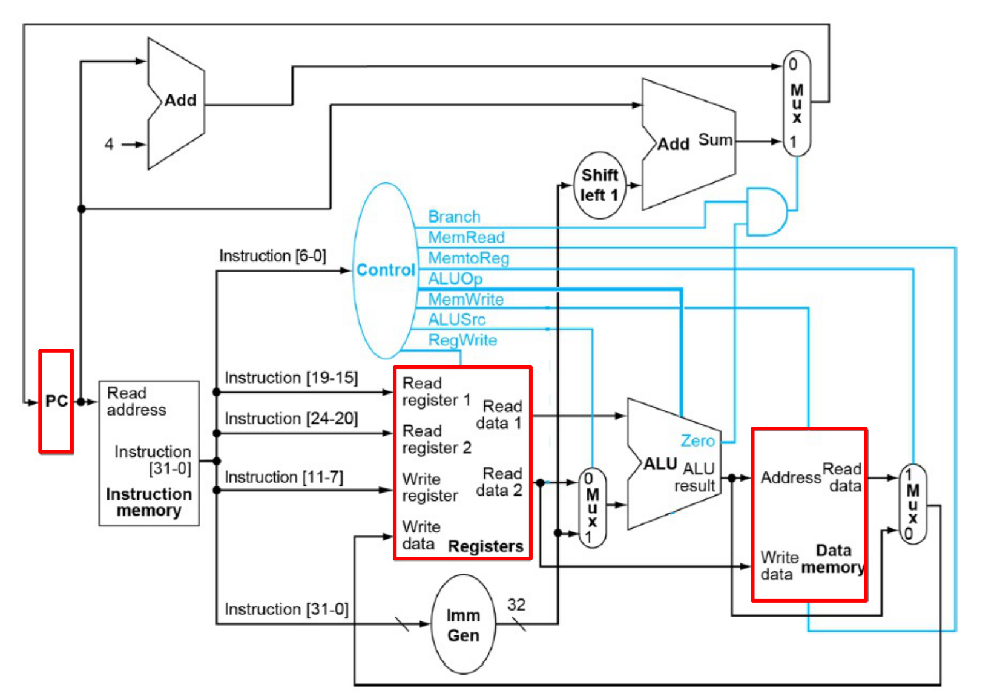

但这不足以完成本实验的任务，我在此基础上进行了如下的修改：

+ PC 选择器。实验的 PC 不仅需要来自 `PC + 4`（大多数指令），`PC + (imm << 1)` （B 类指令或 JAL 指令），还可能来自 ALU（JALR）。该模块写在 `pc_control.v` 中。
+ ALU 的状态码输出。这里 ALU 的状态码输出只有一个 Zero 口，只能应对 BEQ 指令，无法应对 BLT。我选择沿用实验一中的 ALU，把 f 口作为判断 branch 的依据。同时 branch 与否的判断模块写在 `branch_control.v` 中。
+ 增加 check 的控制模块（`chk_control.v`）。因为 CPU 有 `chk_addr` 和 `chk_data` 两根线用于调试。
+ 增加 io 模块（`io_control.v`）。`io_dout` 应该和 Data Memory 的 Write data 是一致的。`io_addr` 则是 `ALU_result` 减掉 MMIO 的起始地址后取低 8 位。如果 `io_addr` 落在 0 ~ 8'h18 的范围内，说明在进行 MMIO，此时如果是 Load 指令，`io_rd` 置 1，如果是 Store 指令，`io_we` 置 1。 
+ Register File 的读写端口。首先按照实验要求，需要增加用于调试的读端口，其读地址为 `chk_addr` 的低 5 位，读出的数据通过 `chk_data` 的选择器送到 `chk_data`。之后其写的数据不止来源于 `Read_data` 和 `ALU_result`，还可能：
  + MMIO 时来自外设（`io_din`）
  + JALR 或 JAL 时来自 `PC + 4`
  + AUIPC 时来自 `PC + extended_imm`
+ Data Memory 的读写端口。按照实验要求，需要增加用于调试的读端口，其读地址为 `chk_addr` 的低 8 位，读出的数据通过 `chk_data` 的选择器送到 `chk_data`。

### 仿真

由于 PDU 对按钮进行了去抖动，对 top 模块进行仿真较为不方便，这里只对 CPU 进行仿真。

#### 指令正确性

将 LabH3 实验步骤一的汇编文件 data 段和 text 段分别导入 Data Memory 和 Instruction Memory。仿真得到下面的波形图（这里我将 `chk_addr` 设为 0x2000，意为查看 Memory 里 0x00 处的值，此时 `chk_data` 就是 MMIO 时对应的 LED 值）：

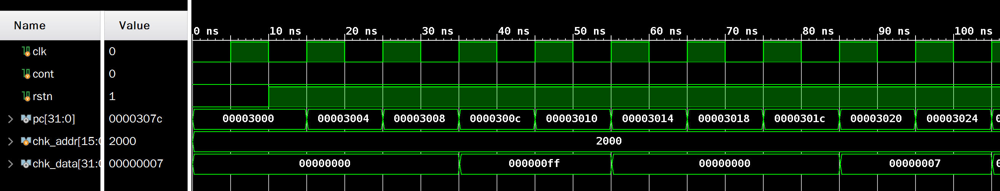

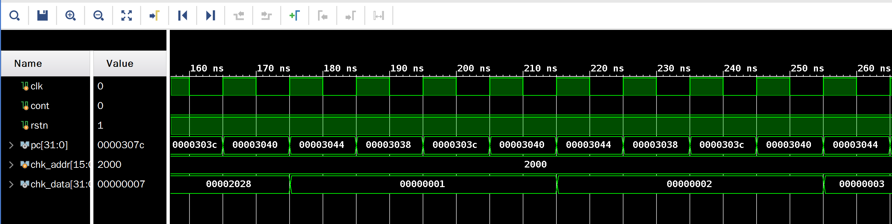

可以发现与 LabH3 测试时的预期结果相符。

#### 测试排序功能

将 LabH3 实验步骤二的汇编文件做少许修改（包括 MMIO 的起始地址和输出部分），之后将 data 段和 text 段分别导入 Data Memory 和 Instruction Memory。仿真得到下面的波形图：

存储器起始状态：

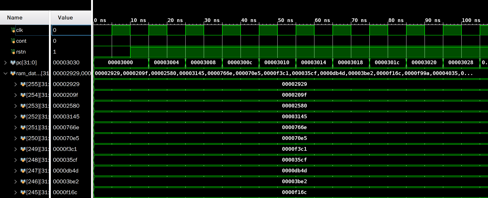

排序过程中：

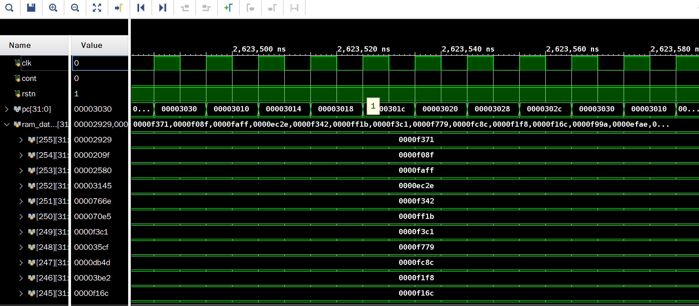

存储器最后的状态：

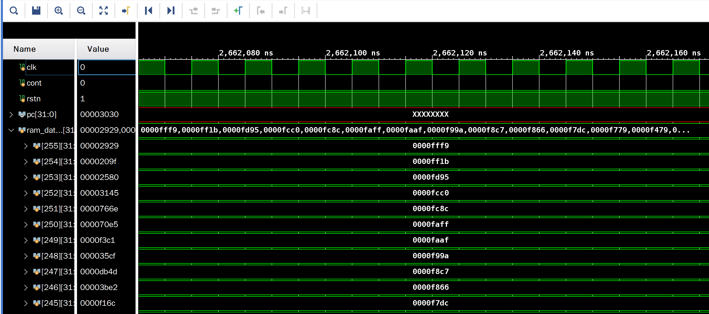

可以发现波形正确。

### 下载结果

下载结果已经线下给助教检查过，这里仅放部分示意图。

#### 指令功能测试

| 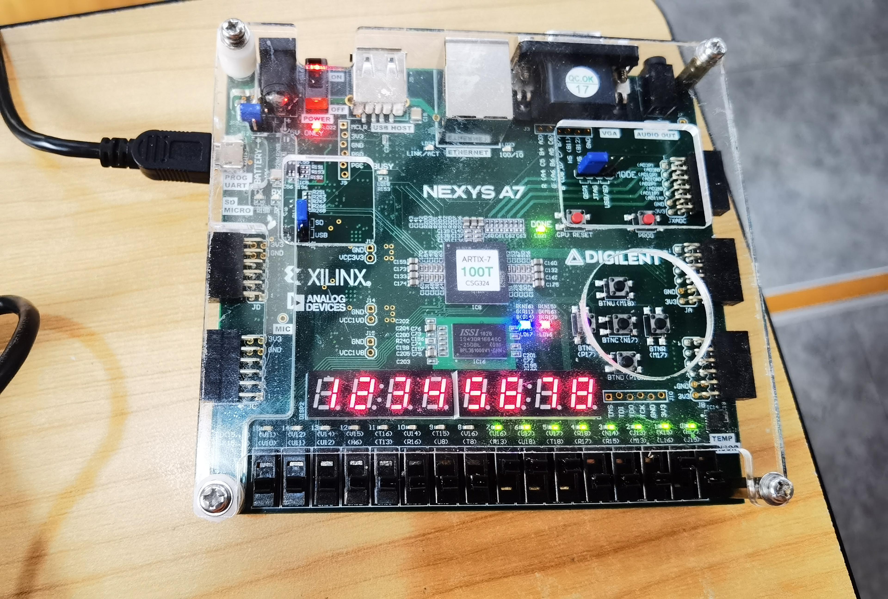addi 测试 | 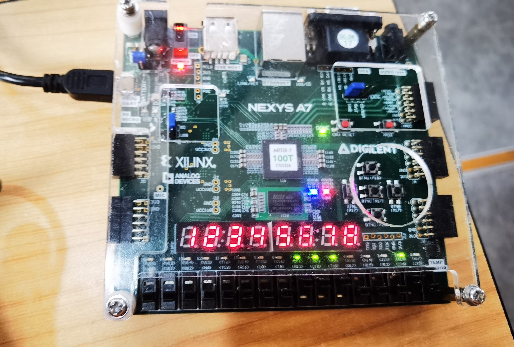lw 测试  |
| ----------------------------- | -------------------------- |
| 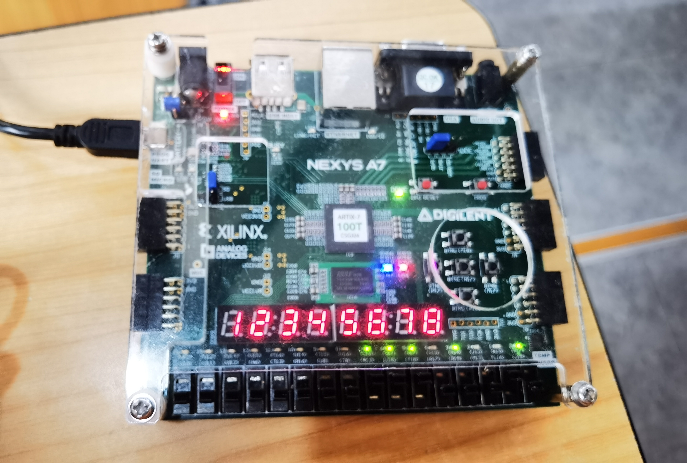add测试    | 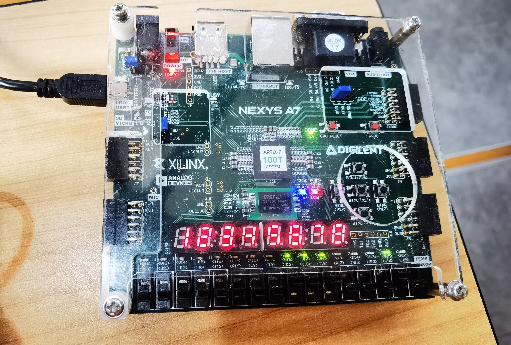sub测试 |

#### 排序

| 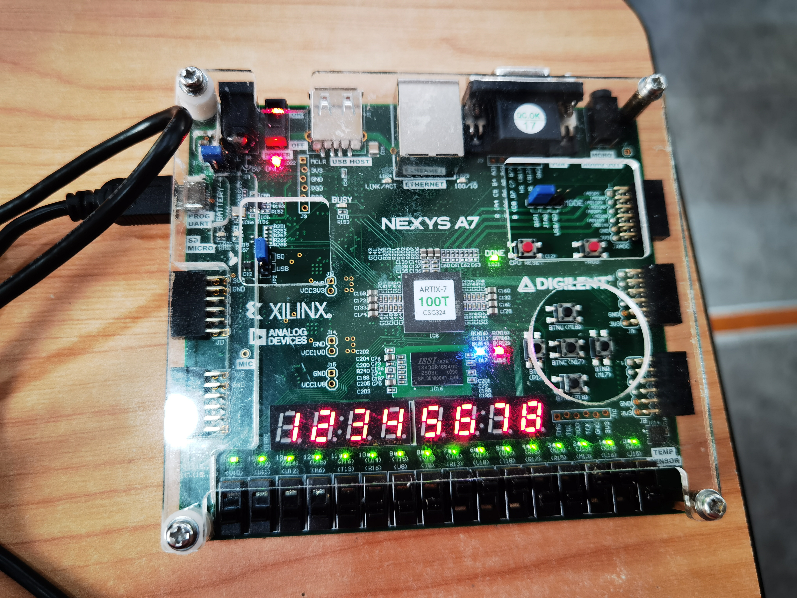初始状态 | 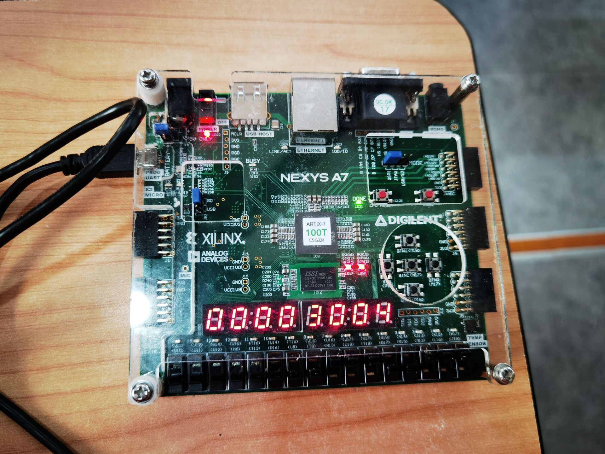查看PC  |
| ------------------------------------------------------- | ----------------------------- |
| 排序后查看内存                       | 查询式输出 |

### RTL 电路

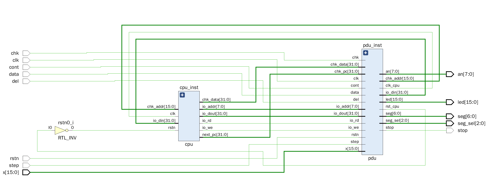

CPU 内部：

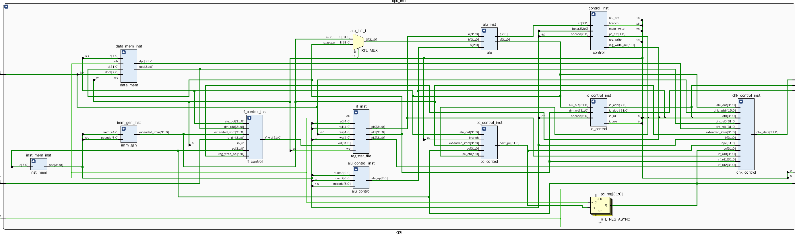

### 电路资源使用情况

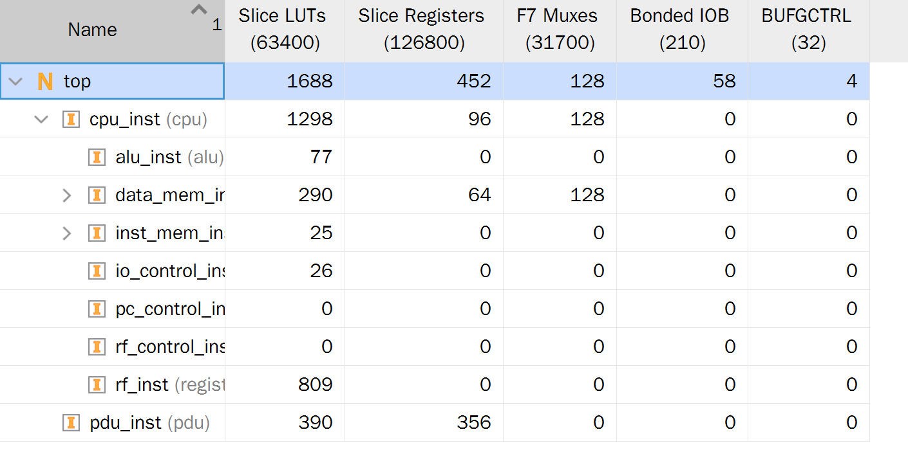

### 综合电路性能

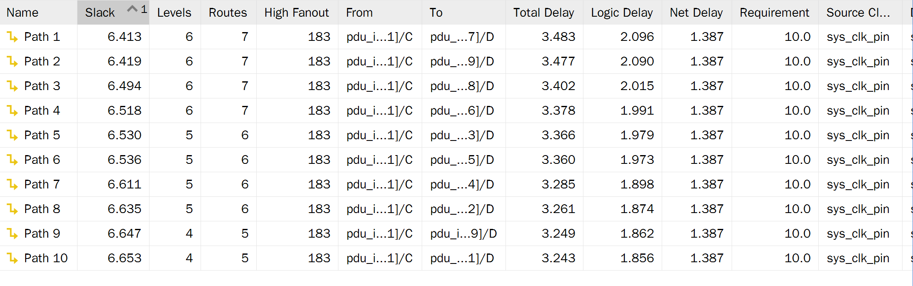

## 总结与建议

通过本次实验，我学会了单周期 CPU 数据通路和控制器的设计，同时积累了很多调试经验。一开始我写完代码便匆匆上板，但甚至 PC 都不会改变，观察 RTL 电路才发现我有很多模块都漏接了线。尽管实验要求里没有仿真一项，但仿真帮我找到了很多问题，包括 PC 的字节寻址需要转化为 Instruction Memory 和 Data Memory 的 32 位宽；PC 的选择器需要拓展选项等。

建议：

+ 明确每页的内容属于哪个模块。因为 PDU 模块是老师实现的，希望老师能够说明实验讲义中哪些部分是需要 PDU 实现的，否则在 PDU 发布前难以明确自己 CPU 的功能是否明确。
+ 优化与实验 3 的衔接。实验 3 的 MMIO 起始地址为 0x7f00 而不是 0xff00，并且在输出时需要转为 ASCII 码后输出，与本实验的要求有较大出入。

