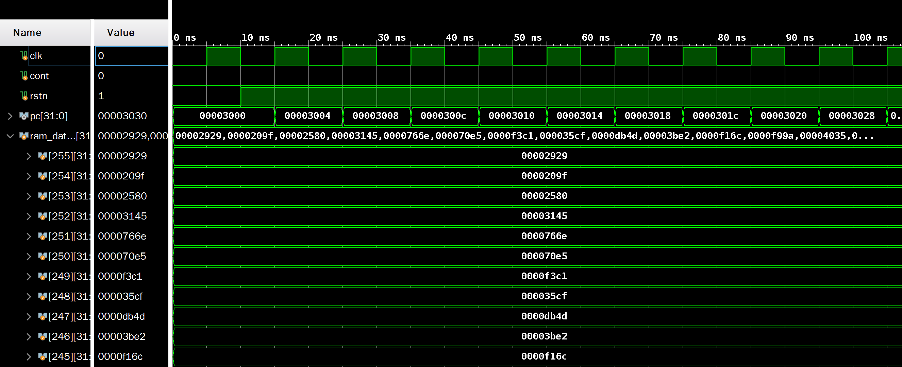
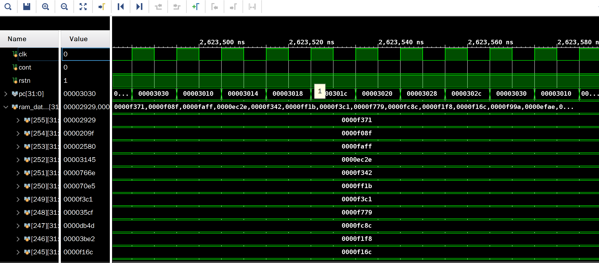

中国科学技术大学计算机学院

《计算机组成原理实验报告》

实验题目：流水线CPU设计

学生姓名：许坤钊

学生学号：PB20111714

完成时间：2022.05.04

## 实验题目

流水线 CPU 设计

## 实验目的

+ 理解流水线 CPU 的结构和工作原理
+ 掌握流水线 CPU 的设计和调试方法
+ 熟练掌握数据通路和控制器的设计和描述方法

## 实验环境

+ Ubuntu 20.04 LTS
+ Vivado 2019.1
+ Nexys4 xc7a100tcsg324-1 开发板

## 实验过程

### CPU 模块设计

分为三步进行：

首先在单周期 CPU 的基础上添加段间寄存器，设计无数据和控制相关的流水线 CPU。

之后添加 `forwarding` 模块，处理数据相关。

最后添加 `hazard` 模块，解决控制相关。

#### 段间寄存器

需要传递的段间寄存器包括：

+ IF 段的 `pc`，`ir`。

+ ID 段的译码得到的 `opcode`，`rs1`，`rs2` 等信号；`imm_gen` 模块生成的 `extended_imm`；通过 `control` 模块生成的控制信号；`register_file` 读出来的 `rd1`，`rd2` 等。

+ EX 段的 `alu_out`，`b` 等。

+ MEM 段的 `rd`，`wd` 等。

其中 `pc` ，控制信号，`alu_out` 等需要一级一级往下传，因为后面的阶段还要用，上面不再赘述。

之后还需要修改单周期寄存器中例化模块的信号，也即细化每个阶段做的事情。

+ IF 段译码，Instruction Memory 用 IF 段的 `if_pc` 去取指。

+ ID 段生成 32 位立即数和控制信号，同时把译码的 `rs1`，`rs2`，`rd` 等传入 Register File。

+ EX 段得出 `alu_out`，同时判断跳转是否成功并计算 `next_pc`。

+ MEM 段进行访存，同时在该阶段处理 MMIO。

+ WB 段用 `mem_to_reg` 选出要写入 `register_file` 的数据并写入。

同时为了解决结构相关，需要把 CPU 设计为哈佛结构。还有 LW + SW 相关。对于类似于 `lw xx xx sw` 这样的流水指令，`lw` 在 ID 段时 `sw` 刚好在 MEM 段，这时为了读出正确的值，需要让 `register_file` 从单周期的读优先改为写优先（事实上我将其也理解为一种 forwarding，数据还没写到寄存器中先读出来）。

#### 解决数据相关

添加 `forwarding` 模块。

首先生成选择信号：如果是 MEM 段的 rd 和 EX 段的 rs 相同，就得选择 MEM 的 `alu_out`；如果 WB 段 rd 和   EX 段的 rs 相同，就得选择 WB 段准备写入 `register_file` 的数据；否则选择原本的输入。

之后通过选择器对 ALU 的输入进行选择即可。

由于 `forwarding` 不能解决 LW 的 RAW 相关，需要在 LW 时插入气泡，进行停顿。具体的做法是，由于只有在 EX 段才能发现是否需要解决 LW 相关（即 EX 段的 `rd` 和 ID 段的 `rs` 相同），因此在 EX 段发现时便产生一个 `stall` 信号，把 IF 和 ID 段的寄存器全部停顿一个周期。

#### 解决控制相关

添加 `hazard` 模块。

该模块接收 `branch` 是否成功和 `opcode` 作为输入，如果是 B 类指令 branch 成功或者是 JAL，JALR 指令，就产生 `flush` 信号，清空 IF 和 ID 段的寄存器。

### 仿真

由于 PDU 对按钮进行了去抖动，对 top 模块进行仿真较为不方便，这里只对 CPU 进行仿真。

存储器起始状态：

排序过程中：

存储器最后的状态：

可以发现波形正确。

### 下载结果

下载结果已经线下给助教检查过，这里仅放部分示意图。

#### 排序

| 初始状态 | 查看PC  |
| ------------------------------------------------------- | ----------------------------- |
| 排序后查看内存                       | 查询式输出 |

### RTL 电路

CPU 内部：

### 电路资源使用情况

### 综合电路性能

## 总结与建议

总结：

通过本次实验，我学会了流水线 CPU 数据通路和控制器的设计，同时积累了更多调试经验。在理论课上我只是学习了基本的理论知识，在写起 Verilog 代码时遇到了不少问题，列举部分如下：

+ 漏掉了不少的段间寄存器。因为我的单周期 CPU 设计与课本不完全相同，例如没有生成 `mem_read` 信号，就需要传递 `opcode` 来判断 LW 指令。
+ 部分信号没有寄存。MMIO 时的 `io_din` 和 `io_rd` 是在 MEM 阶段传入，但是 WB 阶段才使用，因此需要寄存一个周期，我一开始没有寄存，造成输出时的错误。
+ `stall` 信号不止要暂停 PC 和 IF 段的取指，还要暂停寄存器的传递。

建议：

本次实验的难度比较适中，同时还有自动测评项目，建议沿用到下一届并不断优化。
