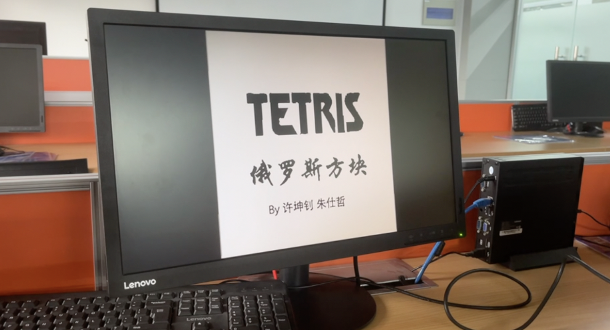
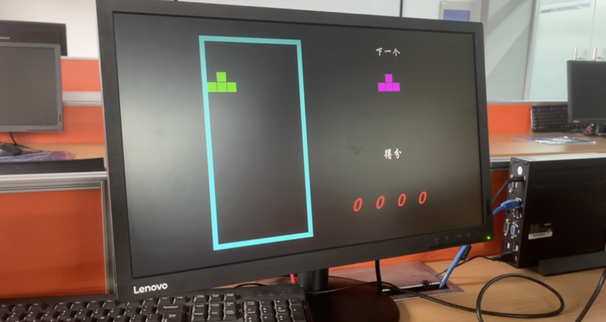
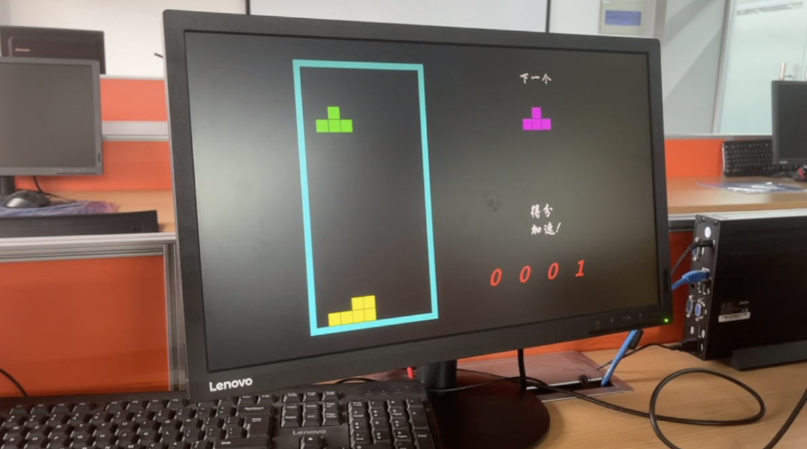

<div style="text-align:center;font-size:2em;font-weight:bold;margin-top:20%">中国科学技术大学计算机学院</div>

<div style="text-align:center;font-size:2em;font-weight:bold;">《计算机组成原理实验报告》</div>


<div style="display: flex;flex-direction: column;align-items: center;font-size:1.5em">
<div>
<p>实验题目：综合设计</p>
<p>学生姓名：朱仕哲 许坤钊</p>
<p>学生学号：PB20111718 PB20111714</p>
<p>完成时间：2022.05.24</p>
</div>
</div>


<div style="page-break-after:always"></div>

## 实验题目

综合实验

## 实验目的

+ 理解计算机硬件系统的组成结构和工作原理

+ 掌握软硬件综合系统的设计和调试方法

## 实验环境

+ Ubuntu 20.04 LTS（许坤钊）MacOS BigSur（朱仕哲）
+ Vivado 2019.1
+ Nexys4 xc7a100tcsg324-1 开发板
+ VGA 外设

## 实验效果

本次实验合作对之前的 CPU 进行了指令拓展。同时完成了通过 VGA 显示，FPGA 控制的俄罗斯方块游戏。VGA 显示为 640 * 480 像素，开发板的上下左右四个按钮用于控制方块，左右移动方块，按下加速下落，按上改变方块的朝向。下面是部分效果图：

开场是一个动画，logo 从中间向两边铺开：



之后进入游戏界面，左侧显示下落的方块，右侧显示下一个生成的方块和得分：



为了增强游戏的可玩性，防止速度太慢，得分后方块下落将加速（“加速！”字样也会在右侧显示）。



## 实现方式

### 俄罗斯方块

编写了如下模块：

+ display_moving_square.v
+ game_display.v
+ display_next.v
+ game_logic.v
+ btn_db.v
+ display_next_square.v
+ square_gen.v
+ btn_edge.v
+ display_score.v
+ start.v
+ btn_edge_db.v
+ display_score_img.v
+ state_machine.v
+ color_select.v
+ display_square.v
+ top.v
+ display_border.v
+ div_clk.v
+ vga_driver.v

下面按照实现的功能介绍各个模块的作用。

#### 时钟分频

由于 640 * 480 分辨率的 VGA 需要 25MHZ 的时钟，首先在 `div_clk.v` 中对 100MHZ 的 `sys_clk` 进行分频，得到 `clk`，之后所有模块的时钟都使用分频得到的 `clk`。

代码如下：

```verilog
`timescale 1ns / 1ps
// 四分频，640*480 的 VGA 显示需要 25MHZ 的时钟
module div_clk(
        input rst_n,
        input sys_clk,
        output reg clk);

    reg[1:0] h;

    always@(posedge sys_clk) begin
        if(!rst_n) begin
            h <= 0;
            clk <= 0;
        end

        else begin
            if(h == 2'b00) begin
                clk <= 0;
                h <= h + 1;
            end
            else if(h == 2'b01) begin
                clk <= 0;
                h <= h + 1;
            end
            else if(h == 2'b10) begin
                clk <= 1'b1;
                h <= h + 1;
            end
            else begin
                clk <= 1'b1;
                h <= h + 1;
            end
        end
    end
endmodule
```

#### 状态机

该游戏的状态机比较简单，只有开场、游戏和结束三种状态，在 `state_machine` 模块中处理状态转换。开场动画共计时 5s，之后转到游戏状态，在其他模块中生成判断游戏结束的 `over` 信号传入该状态机判断是否应该转到结束状态。该模块输出的游戏状态用于 `color_select.v` 中作为选择信号判断 vga 显示的颜色来自什么模块。

```verilog
`timescale 1ns / 1ps
// 状态机控制模块
module state_machine(
        input clk,
        input rst_n,
        input over,
        output reg start_sig,
        output reg gameready_sig,
        output reg over_sig);

    // 3 个状态
    parameter ready = 2'b00, game = 2'b01, game_over = 2'b10;
    // 5s 是这么多个时钟周期，这里 clk 已四分频
    parameter T5S = 30'd125_000_000;
    reg[29:0] count_T5S;
    reg start;

    always@(posedge clk or negedge rst_n) begin // 展示 logo 计时
        if(!rst_n) begin
            start <= 0;
            count_T5S <= 0;
        end
        else begin
            if(count_T5S < T5S) begin
                count_T5S <= count_T5S + 1'b1;
                start <= 0;
            end
            else if(count_T5S == T5S) begin
                count_T5S <= 0;
                start <= 1;
            end
            else begin
                count_T5S <= 0;
                start <= 0;
            end
        end
    end

    reg[1:0] game_current_state;
    reg[1:0] game_next_state;

    always@(posedge clk or negedge rst_n) begin
        if(!rst_n)
            game_current_state <= ready; // 复位
        else
            game_current_state <= game_next_state;
    end

    always@(game_current_state or start or over) begin
        case(game_current_state)
            ready: begin
                {gameready_sig, start_sig, over_sig} = 3'b100;
                if(start)
                    game_next_state = game;
                else
                    game_next_state = ready;
            end
            game: begin
                {gameready_sig, start_sig, over_sig} = 3'b010;
                if(over)
                    game_next_state = game_over;
                else
                    game_next_state = game;
            end
            game_over: begin
                {gameready_sig, start_sig, over_sig} = 3'b001;
                game_next_state = game_over;
            end
            default: begin
                {gameready_sig, start_sig, over_sig} = 3'b100;
                game_next_state = ready;
            end
        endcase
    end

endmodule
```

#### VGA 显示

在 `vga_driver` 模块中处理，属于 VGA 显示的套路，不赘述。

```verilog
`timescale 1ns / 1ps
// 生成游戏时的 VGA 同步信号
module vga_driver(
        input clk,
        input rst_n,
        output[10:0] col_addr_sig,
        output[10:0] row_addr_sig,
        output hsync,
        output vsync,
        output ready_sig);

    parameter H_SYNC_END = 96; // 行同步脉冲结束时间
    parameter V_SYNC_END = 2; // 列同步脉冲结束时间
    parameter H_SYNC_TOTAL = 800; // 行扫描总像素单位
    parameter V_SYNC_TOTAL = 525; // 列扫描总像素单位
    parameter H_SHOW_START = 144; // 显示区行开始像素点
    parameter V_SHOW_START = 35; //显示区列开始像素点

    reg[10:0] cnt_h;

    always@(posedge clk or negedge rst_n) begin
        if(!rst_n)
            cnt_h <= 11'd0;
        else if(cnt_h == H_SYNC_TOTAL)
            cnt_h <= 11'd0;
        else
            cnt_h <= cnt_h + 1'b1;
    end

    reg[10:0] cnt_v;

    always@(posedge clk or negedge rst_n) begin
        if(!rst_n)
            cnt_v <= 11'd0;
        else if(cnt_v == V_SYNC_TOTAL)
            cnt_v <= 11'd0;
        else if(cnt_h == H_SYNC_TOTAL)
            cnt_v <= cnt_v + 1'b1;
    end

    reg isready; // 确保颜色显示在正确的范围内

    always@(posedge clk or negedge rst_n) begin
        if(!rst_n)
            isready <= 1'b0;
        else if(cnt_h >= H_SHOW_START && cnt_h < 11'd784 && cnt_v >= V_SHOW_START && cnt_v < 11'd515)
            isready <= 1'b1;
        else
            isready <= 1'b0;
    end

    assign hsync = (cnt_h < H_SYNC_END) ? 1'b1 : 1'b0;
    assign vsync = (cnt_v < V_SYNC_END) ? 1'b1 : 1'b0;
    assign col_addr_sig = isready ? (cnt_h - H_SHOW_START) : 11'd0;
    assign row_addr_sig = isready ? (cnt_v - V_SHOW_START) : 11'd0;
    assign ready_sig = isready;

endmodule
```

#### 初始界面

将图片通过脚本转成 coe 文件，这里为了防止存储器空间过大，稳妥起见选用黑白图片，存入 ROM 里（本实验的 ROM 均采用 Vivado 提供的块式存储器 IP 核，并在 `top.v` 里统一例化）。

`start.v` 处理开场动画页面，通过两个水平的计数器判断显示的范围。

```verilog
reg[30:0] hcnt;
reg[10:0] lefth;
reg[10:0] righth;

always@(posedge clk or negedge rst_n) begin
    if(!rst_n) begin
        hcnt <= 0;
        righth <= 320;
        lefth <= 320;
    end
    else
        if (ready_sig) begin
            if (righth > 640) begin
                lefth <= 0;
                righth <= 640;
            end
            else
                if (hcnt == flush) begin
                    hcnt <= 0;
                    lefth <= lefth - 1;
                    righth <= righth + 1;
                end
                else
                    hcnt <= hcnt + 1;
        end
end
```

#### 游戏界面

三个 `btn` 开头的模块用于取边沿和去抖动。界面的显示通过一个个使能信号确定，`display_boarder` 确定蓝色的边界，`display_score` 输出游戏的分数（每消掉一行得一分）。

`display_next` 和 `display_score_img` 输出图片“下一个”和“得分”，加速时还会输出闪烁的“加速！”。

#### 小方块的生成

在 `square_gen` 模块生成新的方块。随机数算法采用一个固定的种子跟算法因此随机数序列是一个确定的值。

```verilog
reg[7:0] rand_num;

always@(posedge clk or negedge rst_n) begin
    if(!rst_n) begin
        rand_num <= 8'b1111_1111;
    end
    else begin
        rand_num[0] <= rand_num[7];
        rand_num[1] <= rand_num[0];
        rand_num[2] <= rand_num[1];
        rand_num[3] <= rand_num[2];
        rand_num[4] <= rand_num[3]^rand_num[7];
        rand_num[5] <= rand_num[4]^rand_num[7];
        rand_num[6] <= rand_num[5]^rand_num[7];
        rand_num[7] <= rand_num[6];
    end

end
```

方块一共有 8 种类型，取随机数的低 1-3 位，这样方块的类型在对应周期是确定的。尽管如此，由于加速下落的存在，玩家会发现方块看起来像是随机的。

#### 主逻辑

`game_logic` 模块是游戏的主逻辑，通过一个 500 * 1 的寄存器表示每个格子是否有方块，一个 20 * 1 的寄存器表示每行是否需要消除。同时还控制方块的下落速度。之后所有的信号送到 `game_display` 输出：

```verilog
// 根据各模块状态决定 RGB 输出

`timescale 1ns / 1ps
module game_display(
        input clk,
        input rst_n,
        input ready_sig,                        // RGB 输出使能信号的输入
        input enable_black_border,                // 显示边界的使能信号
        input enable_blue_moving,               // 正在下落的小方块显示使能信号
        input enable_blue_little_flag,          // 静止小方块显示使能信号
        input next_yellow_display,              // 下一个小方块的显示使能信号
        input next_c,                           // NEXT 字符显示使能信号
        input score_out_c,                      // SCORE 字符显示使能信号
        input score,                            // 分数显示使能信号
        output reg [3:0] red,                             // R 信号输出
        output reg [3:0] green,                           // G 信号输出
        output reg [3:0] blue);                           // B 信号输出


    always@(posedge clk or negedge rst_n) begin
        if(!rst_n) begin
            red <= 4'b0;
            green <= 4'b0;
            blue <= 4'b0;
        end
        else if(ready_sig) begin
            red <= {score || next_yellow_display || enable_blue_little_flag || score_out_c || next_c, 3'b0};
            blue <= {next_yellow_display || next_c || enable_black_border || score_out_c, 3'b0};
            green <= {enable_blue_little_flag || enable_blue_moving || enable_black_border || score_out_c || next_c, 3'b0};
        end
    end

endmodule
```

### 指令拓展

在 LabH5 流水线 CPU 设计的基础上，我们又扩展了一些 RISC-V 指令，包括addi,  xori,  ori,  andi,  slli,  srli,  srai,  add,  sub,  sll,  xor,  srl,  sra,  or,  and,  auipc,  jal,  jalr,  beq,  bne,  blt,  bge,  bltu,  bgeu,  lw,  sw 共 26 条 指令。

## 总结与建议

通过本次实验，小组成员第一次接触了外设并用硬件开发了游戏，增强了 Verilog 代码编写和调试能力，同时巩固并加深了对流水线 CPU 数据通路的理解。
