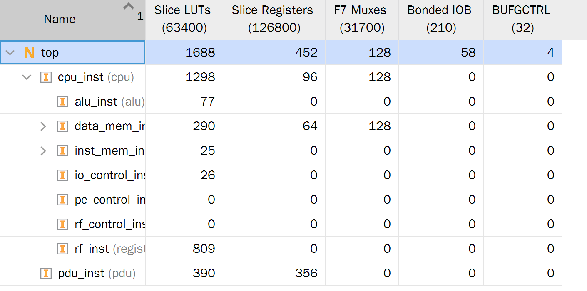
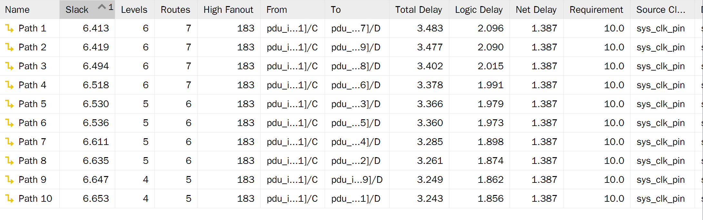

中国科学技术大学计算机学院

《计算机组成原理实验报告》

实验题目：单周期CPU设计

学生姓名：许坤钊

学生学号：PB20111714

完成时间：2022.05.24

## 实验题目

单周期 CPU 设计

## 实验目的

+ 理解单周期 CPU 的结构和工作原理
+ 掌握单周期 CPU 的设计和调试方法
+ 熟练掌握数据通路和控制器的设计和描述方法

## 实验环境

+ Ubuntu 20.04 LTS
+ Vivado 2019.1
+ Nexys4 xc7a100tcsg324-1 开发板

## 实验过程

### 

### RTL 电路

CPU 内部：

### 电路资源使用情况

### 综合电路性能

## 总结与建议

